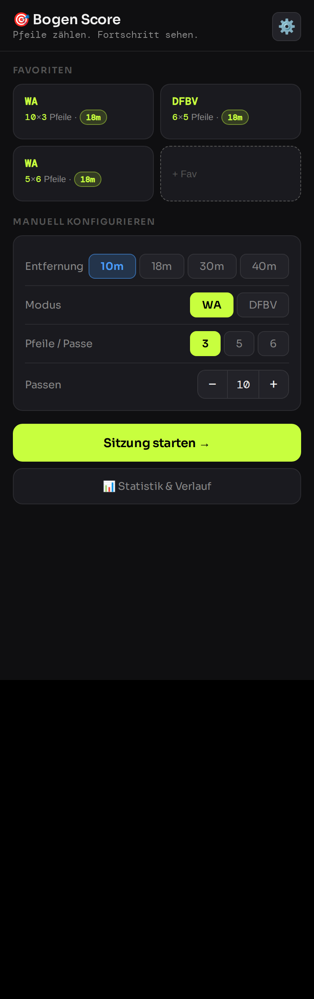

# 🎯 Bogen Score

Bogen Score ("BogenScore") is a lightweight, installable Progressive Web App for tracking archery training sessions — count your arrows, review your passes, and watch your progress over time.



## Features

- Quick-start favorites for your usual training configurations (mode, arrows/passe, number of passes, distance)
- Supports **WA** (World Archery, rings 1–10/X/M) and **DFBV** (rings 1–5/M) scoring
- Tap-to-score arrow entry with pass-by-pass history and inline editing/review before saving
- Session statistics: personal best, most recent score, average, and a score-over-time chart
- Filter stats by mode, score/percentage, time range, and distance
- CSV export/import of your session history
- Installable as a PWA and fully usable offline — all data is stored locally in your browser (`localStorage`), nothing is sent to a server

## Setup

Bogen Score is a single self-contained HTML file with no build step and no dependencies.

1. Clone the repo:
   ```bash
   git clone https://github.com/JoeSey/BogenScore.git
   cd BogenScore
   ```
2. Open `index.html` directly in a browser, or serve it locally for a more realistic PWA experience:
   ```bash
   python3 -m http.server
   ```
   then visit `http://localhost:8000`.
3. On mobile, use your browser's "Add to Home Screen" option to install it as an app.

There is nothing to build, lint, or test — it's plain HTML/CSS/JS in `index.html`.
